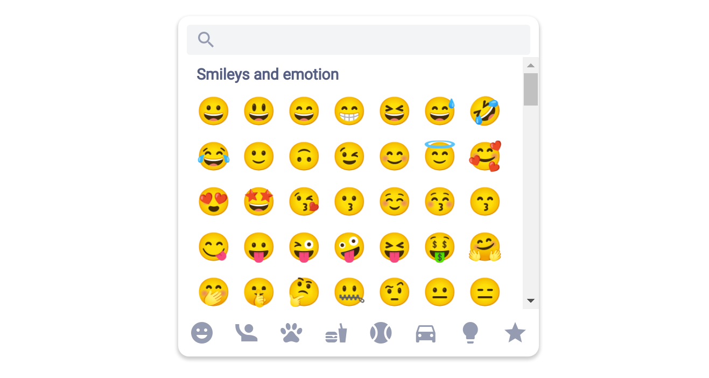

# react-native-emoji-modal

> Feature-complete emoji picker for React Native that mimics the look and feel of native ones.

This is a rewrite of [react-native-emoji-picker](https://github.com/staltz/react-native-emoji-picker-staltz).



**Features:**

- Vertically scrolling with 7 columns of emoji
- Search field
- Category shortcuts
- Supports iOS
- Supports Android
  - It's aware of Android versions and thier availability of emojis
- Supports react-native-web
  - Except for category shortcuts (PRs welcome to fix this!)
- Written in TypeScript
- Lightweight
  - Loads just 163 kB worth of emoji data, versus 1.2 MB in react-native-emoji-picker

## Installation

```bash
pnpm add react-native-emoji-modal
```

or

```bash
npm install --save react-native-emoji-modal
```

## Usage

```jsx
import EmojiModal from 'react-native-emoji-modal';

// ...

<EmojiModal onEmojiSelected={(emoji) => {}} />;
```

## Props

| Prop name             | Description                                                           | Type          | Required | Default                                                                                                                                      |
| --------------------- | --------------------------------------------------------------------- | ------------- | -------- | -------------------------------------------------------------------------------------------------------------------------------------------- |
| `onEmojiSelected`     | Function called when the user presses one of the emojis shown         | function      | true     |                                                                                                                                              |
| `onPressOutside`      | Function called when the user taps outside of the emoji picker region | function      | false    |                                                                                                                                              |
| `columns`             | How many columns of emojis to render in the grid                      | number        | false    | 7                                                                                                                                            |
| `localizedCategories` | Customize the labels for each category                                | Array<string> | false    | `['Smileys & Emotion', 'People & Body', 'Animals & Nature', 'Food & Drink', 'Activities', 'Travel & Places', 'Objects', 'Symbols', 'Flags']` |
| `emojiSize`           | Customize the size of each emoji, in pixels                           | number        | false    | 32                                                                                                                                           |
| `emojiStyle`          | Custom style for each emoji                                           | TextStyle     | false    |                                                                                                                                              |
| `headerStyle`         | Custom style for the label for each category                          | TextStyle     | false    |                                                                                                                                              |
| `scrollStyle`         | Custom style for the FlatList with the grid of emojis                 | ViewStyle     | false    |                                                                                                                                              |
| `searchStyle`         | Custom style for the search TextInput                                 | ViewStyle     | false    |                                                                                                                                              |
| `shortcutColor`       | Color for inactive category shortcuts                                 | color         | false    | `#bcbcbc`                                                                                                                                    |
| `activeShortcutColor` | Color for the active category shortcut                                | color         | false    | `#0c0c0c`                                                                                                                                    |
| `containerStyle`      | Custom style for the "box" in the center                              | ViewStyle     | false    |                                                                                                                                              |
| `backgroundStyle`     | Custom style for the background of the modal                          | ViewStyle     | false    |                                                                                                                                              |
| `modalStyle`          | Custom style for top-level container                                  | ViewStyle     | false    |                                                                                                                                              |

## Support us!

This library was created for [Manyverse](https://manyver.se) and we're very thankful for our [backers on OpenCollective](https://opencollective.com/manyverse), and we need more donations! :pray:

## License

[MIT](LICENSE)
